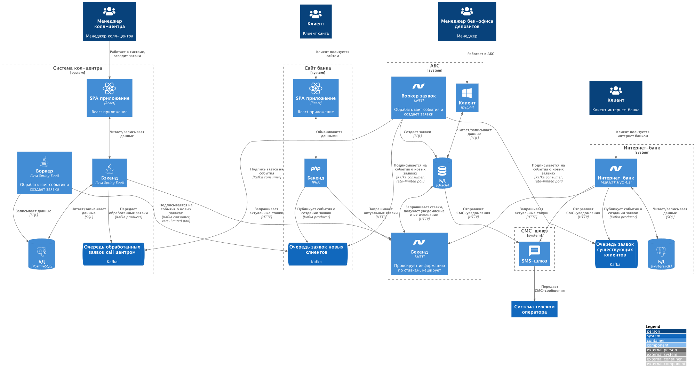

### **Название задачи:** Архитектура системы открытия депозитов
### **Автор:**
### **Дата:** 28.10.2025
### **Функциональные требования**

| **№** | **Действующие лица или системы**          | **Use Case**                                                 | **Описание**                                                                                                                                                                                                                                                |
|:-----:|:------------------------------------------|:-------------------------------------------------------------|:------------------------------------------------------------------------------------------------------------------------------------------------------------------------------------------------------------------------------------------------------------|
|   1   | Клиент, сайт банка                        | Создание заявки на открытие депиозита на сайте банка         | 1. Клиент переходит на сайт 2. Клиент видит список доступных депозитов и их ставки 3. Клиент выбирает депозит и заполняет заявку                                                                                                                    |
|   2   | Менеджер колл-центра, система колл-центра | Обработка заявки на открытие депозита менеджером колл-центра | 1. Менеджер кол-центра видит список новых заявок на открытие депозита 2. Менеджер кол-центра выбирает новую заявку 3. Менеджер кол-центра видит доступные ставки по депозиту 4. Менеджер звонит клиенту 5. Менеджер обновляет статус заявки |
|   3   | Клиент, интернет-банк                     | Создание заявки на открытие депозита в интернет-банке        | 1. Клиент переходит в интернет-банк 2. Клиент видит список доступных депозитов и их ставки 3. Клиент выбирает депозит с заполняет заявку 4. Клиент получает СМС-код с кодом подтверждения 5. Клиент подтверждает заявку                     |
|   4   | Менеджер бэк-офиса депозитов, Клиент, АБС | Одобрение заявки на открытие депозита                        | 1. Менеджер получает заявку на открытие депозита в АБС 2. Менеджер одобряет заявку 3. Клиент получает СМС-сообщение об изменении статуса заявки                                                                                                      |
### **Нефункциональные требования**

| **№** | **Требование**                                                |
|:-----:|:--------------------------------------------------------------|
|   1   | Все сервисы работают 24/7, 99.9% uptime                       |
|   2   | Отклик по операциям <= 700ms                                  |
|   3   | При выборе технологий - использовать те, что уже есть в банке |
|   4   | Для очередей использовать Kafka                               |
|   5   | Избежать прямой работы с API АБС банка                        |
|       |                                                               |
### **Решение**

Диаграмма контекста контейнеров в модели C4

# ADR: Добавление очередей и обновленной архитектуры

## Контекст

Клиент может открыть депозит или накопительный счёт в интернет-банке. В MVP бэк-офис может обрабатывать заявки по старому процессу.

---

## Решения

### 1. Добавление очередей
**Цели:**
- Мгновенная обработка запросов от клиента на создание новой заявки.
- Обеспечение требований мгновенного отклика по операциям.
- Снижение нагрузки на АБС за счет *rate-limited pooling-а* из очереди, что предотвратит чрезмерное количество запросов в АБС.

---

### 2. Новые компоненты

#### Kafka брокер
- **Решение:** добавить Kafka для реализации очередей.
- **Причина выбора:** использование Kafka было указано в нефункциональных требованиях для случаев подключения очередей.

#### Воркер заявок в АБС
- **Назначение:** асинхронная обработка заявок от клиента для снижения нагрузки на базу данных АБС.
- **Особенности:** количество воркеров можно масштабировать по мере необходимости, в зависимости от нагрузки.

#### Новый сервис "Бекенд АБС"
- **Назначение:** предоставление данных о ставках и их кеширование для минимизации обращений к БД АБС.
- **Реализация кеша:** данные о ставках кешируются в памяти сервиса для простоты реализации, так как объем данных невелик (в пределах нескольких мегабайт).

---

### 3. Обеспечение актуальности данных
- БД АБС уведомляет сервис "Бекенд АБС" об изменениях ставок по **HTTP-запросам**, так как **PL/SQL** поддерживает HTTP-вызовы.
- Это гарантирует, что кешированные ставки всегда будут актуальны.

---

### 4. Интеграция с колл-центром
- Данные об обновлении заявок из колл-центра отправляются в **Kafka очередь** для последующей обработки воркером АБС.
- Это снижает нагрузку на АБС со стороны колл-центра, поскольку воркер уже подключен и способен обрабатывать эти сообщения асинхронно.

---

### 5. Выбор технологии
- Для новых систем в АБС выбран **.NET**, так как:
    - большая часть доработок придется на АБС систему;
    - в банке уже есть **20 разработчиков** со специализацией в .NET.

---

## Итого
Реализация очередей и новых сервисов позволит:
- обеспечить мгновенный отклик на клиентские запросы;
- снизить нагрузку на АБС;
- повысить масштабируемость и устойчивость системы.

### **Альтернативы**

### 1. Уведомлять "Бекенд АБС" об изменении ставок с клиента АБС
**Описание:**  
Клиент АБС (Delphi) самостоятельно отправляет уведомление о смене ставок напрямую в сервис "Бекенд АБС".

**Недостатки:**
- Требуется обновление клиента при изменении адреса расположения "Бекенд АБС".
- Необходимо реализовать и поддерживать механизм авторизации запросов в "Бекенд АБС".
- Повышается связанность систем, что усложняет сопровождение.

---

### 2. Кешировать данные о ставках на уровне бэка сайта и интернет-банка
**Описание:**  
Сервисы сайта и интернет-банка хранят собственные копии ставок для ускорения отклика и снижения обращений к АБС.

**Недостатки:**
- Каждый сервис-потребитель должен быть явно уведомлен, что нельзя напрямую нагружать АБС запросами.
- риск нарушения этого требования со стороны сервисов, особенно при изменении команды или логики.
- Распределенный кеш приводит к возможным расхождениям в данных.

---

### 3. Использовать брокер событий (Kafka) как посредника уведомлений
**Описание:**  
БД АБС публикует события об изменении ставок в Kafka, а "Бекенд АБС" подписывается на эти события.

**Преимущества:**
- Слабая связанность: изменение адреса или структуры сервиса не требует обновления клиента.
- Масштабируемость и гибкость для других подписчиков, которые могут реагировать на изменения ставок.

**Недостатки:**
- Увеличивается сложность архитектуры и инфраструктуры (поддержка Kafka и мониторинг).
- Задержка между обновлением ставок и их отражением в "Бекенд АБС".
