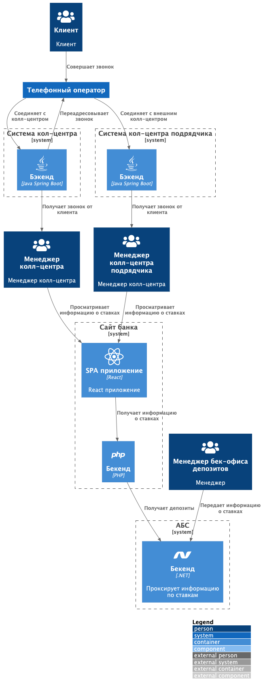
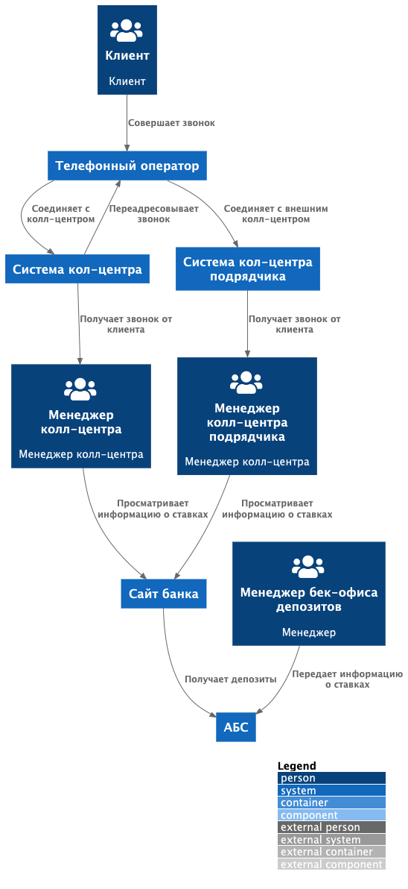

### **Название задачи:** Архитектура системы открытия депозитов
### **Автор:**
### **Дата:** 30.10.2025
### **Функциональные требования**

| **№** | **Действующие лица или системы**                                   | **Use Case**                                                 | **Описание**                                                                                                                                                                                                                                                |
|:-----:|:-------------------------------------------------------------------|:-------------------------------------------------------------|:------------------------------------------------------------------------------------------------------------------------------------------------------------------------------------------------------------------------------------------------------------|
|   1   | Клиент, сотрудник внешнего колл-центра/сотрудник колл-центра банка | Получение информации о актуальтных ставках через колл-центр  | 1. Клиент звонит в колл-центр 2. Колл-центр принимает звонок и передают информацию о текущих ставках банка                                                                                                                                              |
### **Нефункциональные требования**

| **№** | **Требование**                                                                     |
|:-----:|:-----------------------------------------------------------------------------------|
|   1   | Изменения должны быть на основе теущего решения со ставками                        |
|   2   | Сотрудник внешнего колл-центра должен иметь возможность получить актуальные ставки |
|   3   | Действующие ставки невозможно передать во внешний колл-центр по API                |
### **Решение**

Диаграмма контекста контейнеров в модели C4

Диаграмма системного контекста в модели C4

# ADR: Предоставление доступа сотрудникам колл-центра к актуальным ставкам банка

## Контекст

Нужно, чтобы сотрудники кол-центра могли проконсультировать клиентов хотя бы по текущим ставкам банка. Для этого надо каким-то образом предоставить их системе доступ к ставкам по депозитам.

---

## Решения

### 1. В инструкцию работы менеджеров колл-центра приложить ссылку на сайт банка, который будет отображать актуальны ставки

Этот вариант был выбран так как он позволит легко предоставить данные по ставкам сотрудникам колл-центра без задействования лишних ресурсов для реализации MVP

---
### **Альтернативы**

### 1. При изменении ставок отправлять файл с новыми ставками на почту главному менеджеру внешнего колл-центра
**Описание:**  

Новый сервис "Бекс АБС" получает уведомление о измнении ставок. Возможна отправка файла с новыми ставками по почте во внешний сервис колл-центра

**Недостатки:**
- Возможна значительная задержка между обновлением ставок и передачей их каждому сотруднику колл-центра
- Дополнительные ресурсы на реализацию

---

### 2. Сделать отдельный сервис для сотрудников внещнего кол-центра
**Описание:**  
Сотрудники внешнего кол-центра авторизуются в отлельном сервисе, и просматрвиают ставки 

**Недостатки:**
- Сложность реализации
