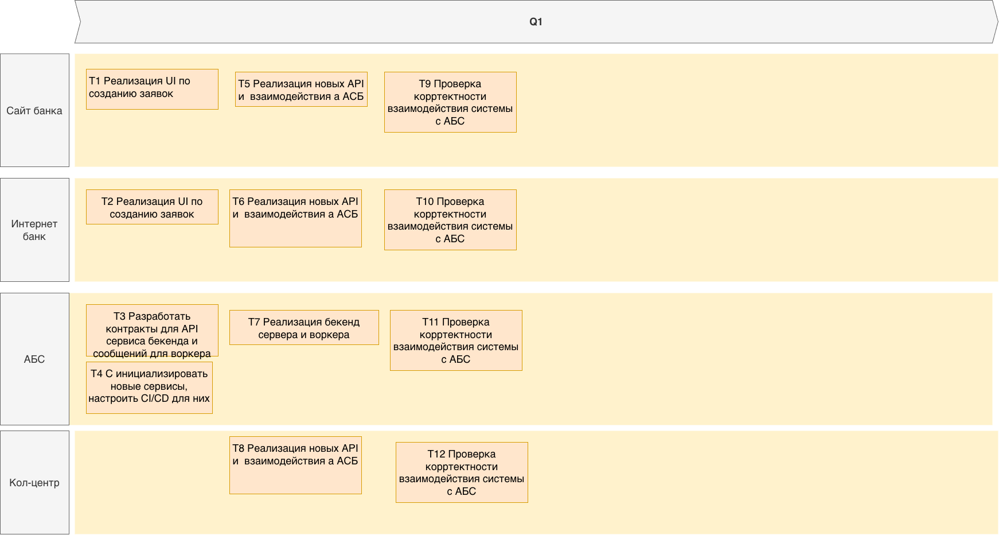

Список крупных задач для каждой системы из ADR
- T1 Реализация UI по созданию заявок в сайте банка
- T2 Реализация UI по созданию заявок в интернет банке
- T3 Разработать контракты для API сервиса бекенда и сообщений для воркера в система АБС
- T4 С инициализировать новые сервисы, настроить CI/CD для каждого из новых сервисов
- T5 Реализация новых API и  взаимодействия а АСБ в сайте банка
- T6 Реализация новых API и  взаимодействия а АСБ в интернет банке
- T7 Реализация бекенд сервера и воркера в АБС
- T8 Реализация новых API и  взаимодействия а АСБ в сайте банка
- T9 Проверка корртектности взаимодействия системы с АБС в интернет банке

Roadmap: 